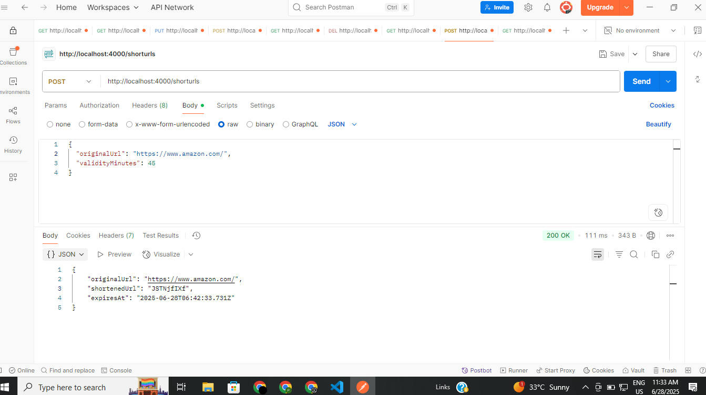

# urlController.js

This file contains the controller logic for the URL Shortener microservice.

## Functions

### createShortUrl

- **Purpose:**  
  Creates a new shortened URL with a specified or default validity period.

- **Request Body:**  
  - `originalUrl` (string, required): The URL to be shortened.
  - `validityMinutes` (number, optional): Validity period in minutes (defaults to 30).

- **Response:**  
  - `originalUrl`: The original URL.
  - `shortenedUrl`: The generated short code.
  - `expiresAt`: Expiry timestamp.

- **Error Handling:**  
  - Returns 400 if `originalUrl` is missing.
  - Returns 500 for server errors.

---

### getOriginalUrl

- **Purpose:**  
  Retrieves the original URL and expiry time for a given short code.

- **Route Parameter:**  
  - `shorturl`: The short code.

- **Response:**  
  - `originalUrl`: The original URL.
  - `expiresAt`: Expiry timestamp.

- **Error Handling:**  
  - Returns 404 if the short URL is not found or expired.
  - Returns 500 for server errors.

---

## Example Usage

### Shorten a URL

**POST** `/shorten`
```json
{
  "originalUrl": "https://www.example.com",
  "validityMinutes": 45
}
```

### Retrieve Original URL

**GET** `/:shorturl`

**Response:**
```json
{
  "originalUrl": "https://www.example.com",
  "expiresAt": "2024-06-28T12:34:56.789Z"
}
```

